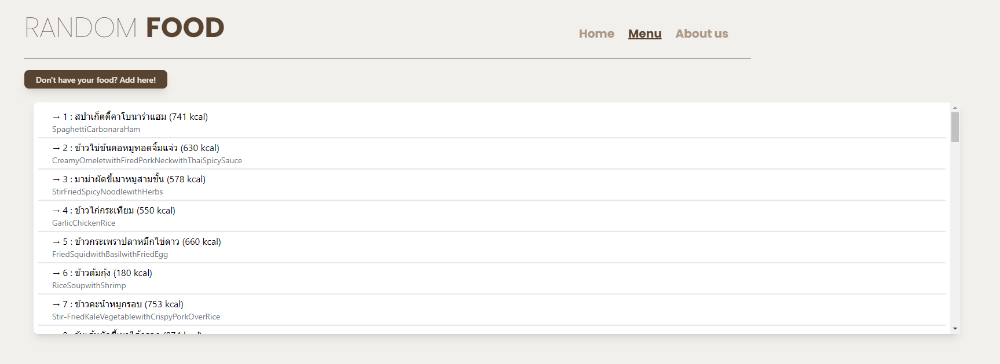
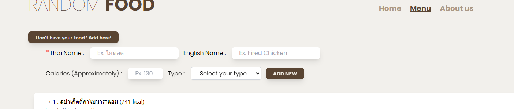
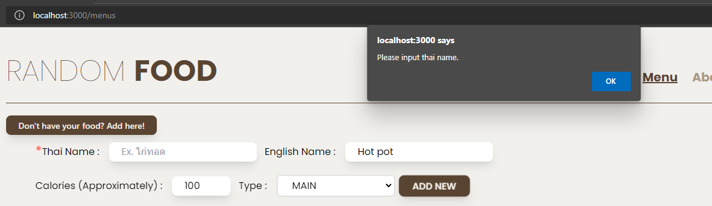
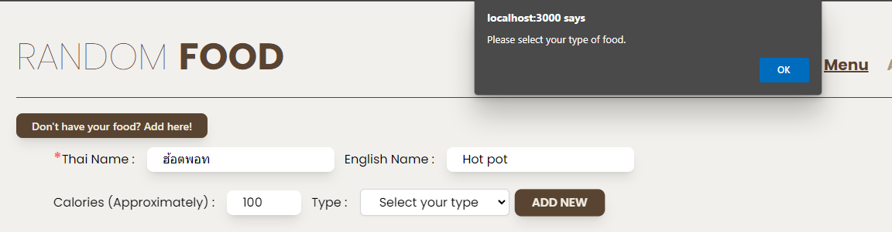
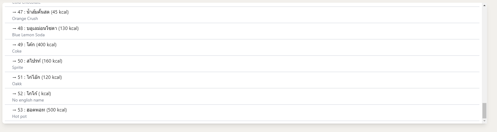

# RANDOM FOOD APPLICATION

#### เว็บไซต์นี้สร้างขึ้นเพื่อให้ผู้ใช้สามารถสุ่มรายการอาหาร

 

## Inspiration (แรงบันดาลใจ)

#### เว็บไซต์นี้เกิดจาก Pain point ของคนในกลุ่มที่ว่าในทุก ๆ วันจะต้องสั่งอาหารมาทาน แต่ในแต่ละมื้อก็คิดไม่ออกว่าจะทานอาหารอะไรดี ทางกลุ่มจึงได้สร้างเว็ปไซต์นี้เพื่อจัดการปัญหานั้น

 

## Table of Content

| Part | Name              |Navigate to|
|:---:|-------------------|--------------|
|  1  |What's in this web|[Navigate me!](#whats-in-this-web)|
|  2  |Home page|[Navigate me!](#home-page)|
|  3  |Menu Page|[Navigate me!](#Menu-page)|
|  4  |About us Page|[Navigate me!](#about-us)|
|  5  |Components|[Navigate me!](#components-expaination) |
|  6  |Others|[Navigate mw!](#others) |
|  7  |Learning Otcome|[Navigate mw!](#learning-outcomes)

 

# What's in this web?

### ในเว็บไซต์ของเราประกอบไปด้วย 3 หน้าหลัก ๆ

- ### [Home page](#home-page)
- ### [Menu page](#menu-page)
- ### [About us](#about-us)

# Home page
<!-- รูปภาพ -->
หน้า Home page เป็นหน้าหลัก โดยมีจะมีชื่อ Website, Navbar, การ Random Food และ History 
<!-- รูปภาพ -->
- Random Food  
จะเป็นการสุ่มอาหารตาม type ที่กำหนดไว้ให้แล้ว โดยจะมี Main,  Side, Dessert, Drink, Snack และ All(Random Food) พอ User ทำการกดปุ่มการ Random Food มีการสุ่มอาหารจาก Menu List ที่จาก API มีไว้ให้ และทำการสุ่มออกมา เป็นรูปภาพ ชื่อ และแคลลอรี่
<!-- รูปภาพ -->
- History
จะเป็นการเก็บ History ของเมนูการสุ่มอาหาร และทาง User สามารถลบรายการที่ไม่ต้องการออกไปได้โดยการกด X ทางด้านขวามือ และยังมีระบบที่บอกว่า User สุ่ม Type ของอาหารไปแล้วกี่อย่าง โดยจะนับจาก Type ใน History

# Menu page

หน้า Menu page เป็นหน้าที่จะแสดง list menu อาหารที่สามารถจะถูกสุ่มออกมาได้ โดยใน List นี้จะประกอบด้วย list ที่มีให้อยู่แล้ว 50 เมนูกับ menu ที่ user เพิ่มเข้ามาเอง 
โดย user สามารถเพิ่ม menu เข้าไปใน list ได้ด้วตนเองโดยกดปุ่ม 'Don't have your food? Add here!' ที่ด้านบนซ้ายมือ

พอกดแล้วจะมีหน้า add food แสดงออกมาให้ใช้งานโดยให้ user ใส่ชื่อภาษาไทย,ภาษาอังกฤษ,cal และ type ของ menu ที่ต้องการจะเพิ่มได้

โดยที่จะต้องบังคับใส่ก็คือชื่อภาษาไทยกับ type ของอาหาร ถ้าไม่ได้ใส่ก็จะมีการแจ้งเตือนขึ้น

พอ add เสร็จแล้ว menu ใหม่ก็จะถูกเพิ่มที่ส่วนล่างสุดของ menu list

 

# About us 
<!-- รูปภาพ -->
หน้า About us เป็นหน้าที่บอกถึงว่ามีสมาชิกภายในทีมมีใครบ้าง ชื่ออะไรครับ ทำอะไรบ้างภายใน Website แล้วก็ยังมี Social Media ของสมาชิกแต่ละคนด้วย

 

# Components Explanation

- AddFoodForm
เป็น component ที่ใช้ในส่วนของ addFood ในหน้า menu โดยจะสร้าง Form และปุ่ม add เพื่อส่งข้อมูลไปใช้ add function ในหน้า menu ต่อไป
<!-- รูปภาพ -->

- BaseNavbar
เป็น component ที่ใช้กับ router-link ที่คอยเปลี่ยนหน้าแสดงผลของ Home,Menu,AboutUs 
<!-- รูปภาพ -->

- History
เป็น component ที่แสดงผลกับ History ของ Meun ที่ถูกสุ่มออกมา เพื่อนำไปใช้กับหน้า Home 
<!-- รูปภาพ -->

- MemberProfile
เป็น component ที่ใช้แสดงข้อมูลต่างๆของ ผู้สร้าง web ขึ้นมา ในหน้า AboutUs
<!-- รูปภาพ -->

- MenuList
เป็น component ที่แสดงผลกับ List ของ Meun ที่มีอยู่ในตอนนี้ เพื่อนำไปใช้กับหน้า Menu 
<!-- รูปภาพ -->

- RandomFood
เป็น component ที่แสดงผลในส่วนของการสุ่ม จะแสดงผลในหน้า Home
<!-- รูปภาพ -->

 

# Others 

#### This is section for others  

 

# Learning Outcomes

#### This is section for learnnig outcomes 

 

### Group member

| No. | Name              | Student ID   |
|:---:|-------------------|--------------|
|  1  | นางสาวกาญจนาพร ชื่นมณีรัตน์ [Kanjanaporn Chuenmaneerat](https://github.com/VioletKan) | 63130500005  |
|  2  | นางสาวจริยาวดี แถมศรี [Jariyawadee Tamsri ](https://github.com/jariyawa) | 63130500008  |
|  3  | นายจักริน ไชยบุบผา [Jakarin Chaibubpa](https://github.com/jakarin-b) | 63130500009 |
|  4  | นายชานนท์ รักดี [Chanon Rugdee](https://github.com/ImFineGarrix)  | 63130500020 |
|  5  | นายโชติวิทย์ เสือยันต์ [Chotiwit Souyan](https://github.com/xbklyn) | 63130500026 |

**Instructor:** [T. UMAPORN SUPASITTHIMETHEE](https://github.com/umaporn-sup)

 **This project is for subject INT203 Client-Sided Web Programming II**
